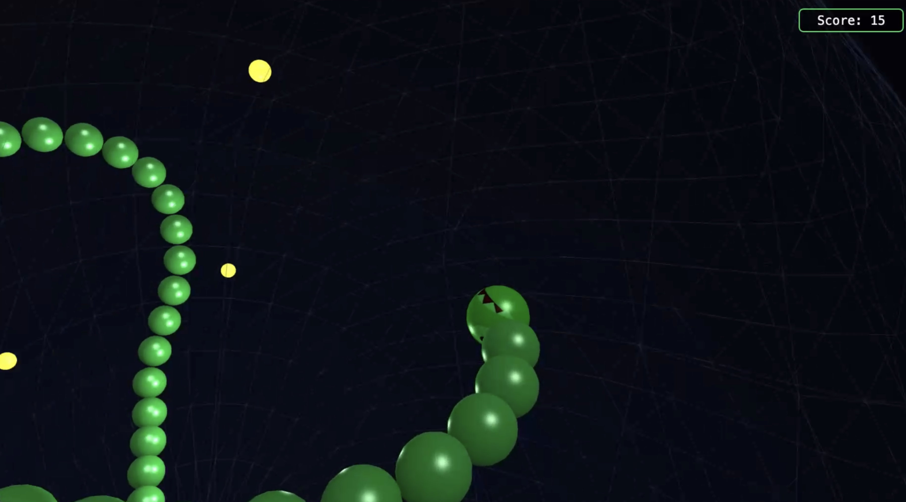

# 3D Snake

The classic game of Snake reimagined in 3D. 

Float inside of a sphere and collect glowing dots as you get longer. The longer you get, the harder it becomes to avoid crashing into yourself!

Try not to get motion sick, and good luck!



---

## How to Play

### Goal

Eat as many glowing dots as you can. Your snake grows longer with each one, so things get tricky fast! The game ends if you run into your own body or touch the wall of the sphere.

### Controls

|                  | Keyboard                       | Gamepad            |
|------------------|--------------------------------|--------------------|
| Steer up/down    | `W` / `S` or `↑` / `↓`        | Left stick / D-pad |
| Steer left/right | `A` / `D` or `←` / `→`        | Left stick / D-pad |
| Confirm / Select | `Space` or `Enter`             | A button           |
| Pause            | `Escape`                       | Start              |

### Tips

- **Dots come to you** — Get close to a dot and it'll slide toward your head like a magnet.
- **Give yourself room** — Your snake grows 3 segments every time you eat, so plan your turns ahead.
- **Watch the walls** — The sphere boundary is a instant game over, just like running into yourself.
- **Beat your best** — Your high score is saved, so try to top it next run!

---

## Running Locally

You'll need [Node.js](https://nodejs.org) and [pnpm](https://pnpm.io) installed.

```bash
# Install dependencies
pnpm install

# Start the development server (with hot reload)
pnpm dev

### Or, if you want to run the optimized build:

# Build for production
pnpm build

# Preview the production build
pnpm preview
```

Once the server starts, open your browser to the URL it prints (usually `http://localhost:5173`).
